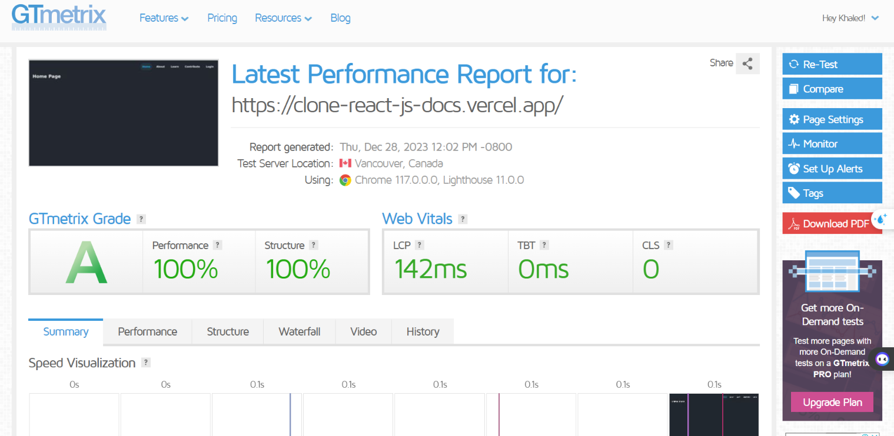

# Clone React.js Docs — React App

## 👁️ Project Preview

Live Preview 👉 <https://clone-react-js-docs.vercel.app/>

## 📝 Project Description & features

The Clone React.js Docs is a web application built to practice React router dom on this website. This project is developed using diverse technologies including TypeScript for static typing, React.js for building the user interface, Tailwind CSS for styling, React Router Dom for routing, and React Hooks for state management.The application includes features such as protected routes, error handling for routes, and controller components. The protected routes ensure that certain parts of the application are only accessible to authenticated users. The application handles routing errors gracefully by displaying appropriate error messages. Controller components are used to manage state and pass down methods to child components.

## 🛠️ Project Tools

- TypeScript
- React.js
- Tailwind CSS
- React Router Dom
- React Hooks

## ✨ Project Skills applied

- Protected Router
- Handle Errors Routes
- Controller Component
- pixel-perfect

## 🧪 Project performance test

Test the performance of the webpage after deploy by using GTmetrix.

## 👋 Get In Touch

- 🌐 Website 👉 <https://khaledellithy-portfolio.vercel.app/>
- 👔 LinkedIn 👉 <https://www.linkedin.com/in/khaledashrafellithy/>
- 🌟 Github 👉 <https://github.com/KhaledEllithy310>
- 📧 Email 👉 <khaledellessy310@gmail.com>
- ☎️ Whatsapp 👉 (+20) 112-461-2043

2024 © Khaled Ellithy
